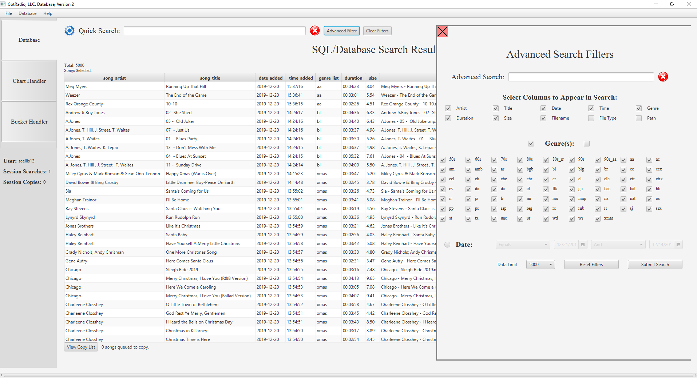

# DatabaseViewer
This program was created for official company use to view and retrieve company data and files. 
The application uses JavaFX and JSch to remotely connect to the Server-Side MySQL Database, as well as copy and move files remotely. 

Updates/Progress
  1/20/2020 - Phase 1 is Tested and Complete. Database Handler is functional and company users have login access and song retrieval.
  
Current Objectives
  1. Incorporate Song Chart comparison tool with integrated 'Library Song Look-up' feature.
  2. Include custom Chart Creator that allows users ability to create customer chart columns for comparison.
  3. Incorporate Copy Song History Table within the Copy List Handler.
  
Project Photos

